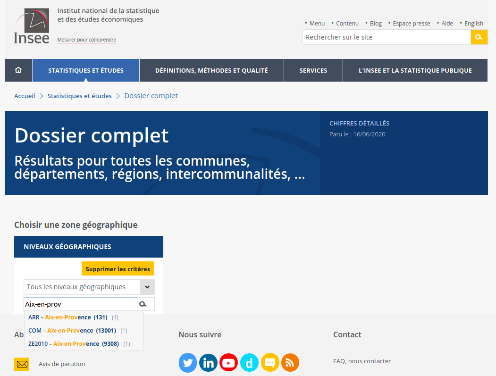
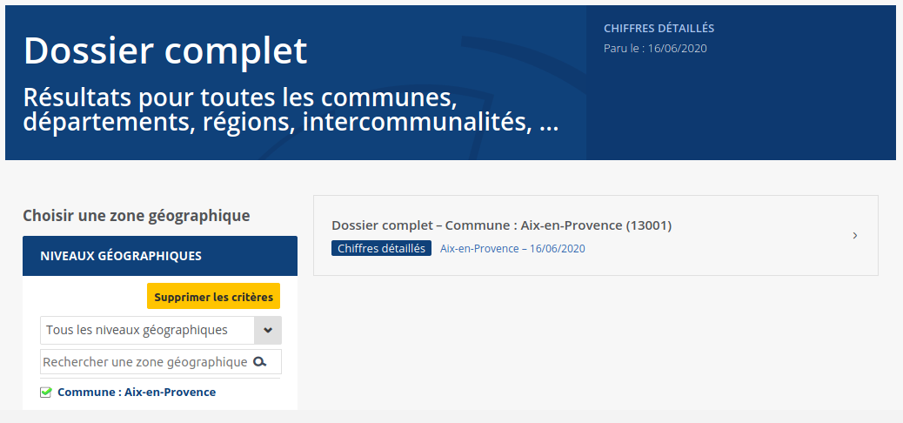
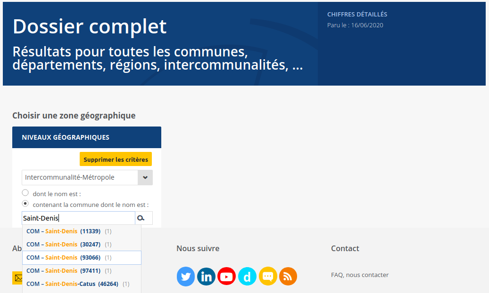
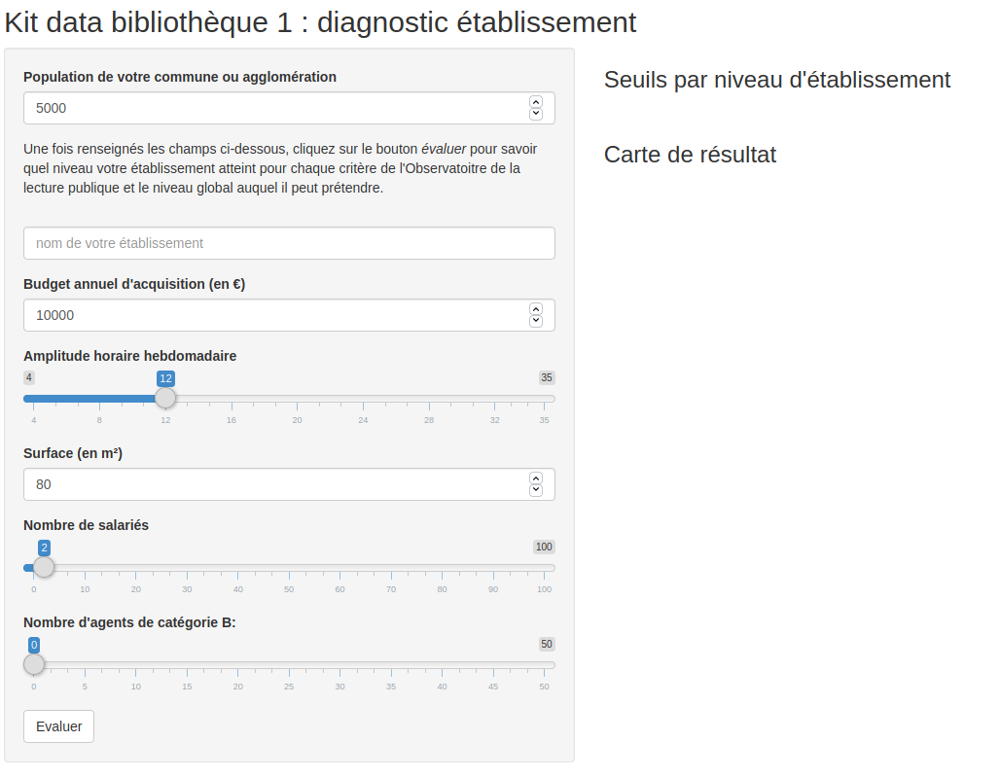

# Diagnostic de l'établissement

Le diagnostic de l'établissement constitue la première étape du bilan. Un des points clefs de ce diagnostic est **l'évaluation du niveau de votre bilbiothèque suivant la classification en vigueur**. Elle repose sur cinq indicateurs, conformément aux normes et recommandations de l'État :

* euros de crédit d'acquisition ;

* heures d'ouverture hebdomadaire ;

* surface (minimum et par habitant) ;
  
* salariés qualifiés ;

* agent de catégorie B (pour les bibliothèques de niveau 1).

Selon les seuils atteints, l'établissement pourra revendiquer une classification en bibliothèque de niveau 1, 2 ou 3, conditionnant en partie l'aide de l'État pour les aides à l'extension des horaires, les outils numériques, etc.

```{r, echo=FALSE}

seuils <- readxl::read_xlsx("./data/bibli_seuils.xlsx")
knitr::kable(seuils, align = "lccccccc")
```

Cette évaluation nécessite donc trois jeux de données :

A. **les données de la bibliothèque** (qu'il s'agisse de vos propres informations ou de celles fournies au ministère via le logiciel Scrib) ;

B. **la population de votre commune ou intercommunalité** ;

C. **les seuils de référence édictées par l'État**.

Une fois ces données collectées, nous vous proposerons un outil pour évaluer la classification de votre établissement.


## Collecte de données

### Données population : l'Insee

La première étape de notre collecte de données va consister à recueillir la population de la commune ou de l'agglomération où se situe votre établissement. En effet, 4 des 7 critères d'évaluation des établissements dépendent de la population (voir tableau ci-dessus).


Le recensement de la population française s'appuie sur une enquête nationale de cinq ans menée par l'Insee et conduite sur le terrain par des agents employés par les municipalités. Il constitue, vis-à-vis des autorités, la source de référence pour les données démographiques, d'où le nom de **population légale** donnée à son indicateur le plus utilisé.

L'accès aux résultats du dernier recensement de la population en date se fait par l'interface mise à disposition sur le site de l'Insee sous le nom de [dossier complet](https://www.insee.fr/fr/statistiques/zones/2011101) :



Sur cette page, vous pouvez chercher de deux manières :

**soit en tapant le nom de votre commune**

Il vous suffit alors de choisir dans le menu déroulant la commune correspondante (précédée du code "**COM**" et suivi du code Insee entre parenthèses) :



**soit en sélectionant un niveau géographique**

Dans cet exemple, la population des intercommunalités ou métropoles peut être utilisée pour calculer les ratios. Il suffit alors de sélectionner ce niveau dans le menu déroulant et de cliquer sur le bouton indiquant les niveaux géographiques *"contenant cette commune"* (voir ci-dessous) :



Les résultats s'affichent à droite du champs de recherche, il ne vous reste plus qu'à consulter le tableau **Évolution et structure de la population** et à noter le chiffre correspondant à **l'ensemble** de la population dans votre tableur.

Pour reprendre l'exemple d'Aix-en-Provence, le tableau d'évolution et structure de la population apparaît immédiatement sous le menu. Il indique en première ligne du tableau *POP T0* la population de la commune des trois dernières vagues de recensement ayant concerné cette ville : 2007, 2012 et 2017, dernière valeur disponible, à retenir pour vos calculs.

### Données bibliothèques

Les cinq indicateurs requis reposent sur quatre type de données portant sur votre établissement :

* le budget d'acquisition annuel global en euros ;

* l'amplitude hebdomadaire moyenne en nombre d'heures ;

* la surface des espaces publics en mètres carrés ;

* les effectifs salariés, leur qualification et leur grade dans la fonction publique.

Il s'agit rigoureusement des mêmes données que celles demandées chaque année à l'occasion du rapport transmis au ministère via Scrib dans le cadre de l'[Observatoire de la lecture publique](https://www.culture.gouv.fr/Sites-thematiques/Livre-et-lecture/Bibliotheques/Observatoire-de-la-lecture-publique) :


Libre à vous donc de **réunir ces données manuellement** ou de **les récupérer via [le portail de l'Observatoire de la lecture](olp.culture.fr/)**.

Une fois les cinq données demandées réunies, nous allons les comparer aux seuils calculés sur la base de la population de la zone géographique où est implantée votre établissement.


## Outil d'auto-évaluation

Pour vous simplifier la tâche, nous vous proposons une application qui va calculer pour vous votre niveau. Elle est accessible en version bêta [sur la page de l'outil Shinyapps](https://sylvain-lapoix.shinyapps.io/app_kit_data/) (en version bêta).

### Évaluer votre établissement



L'application se divise en deux panneaux :

* à gauche, **le panneau de collecte des données** où vous êtes invité·e à renseigner les données nécessaires au diagnostic :

  1. population légale de la zone où votre établissement est implanté (commune ou intercommunalité) ;
  
  2. budget d'acquisition ;
  
  3. amplitude horaire hebdomadaire ;
  
  4. surface ;
  
  5. nombre d'agents ;
  
  6. nombre d'agents de catégorie B ;
  
  7. en complément : le nom de votre établissement.
  
* à droite, **le panneau de résultat** où vous retrouverez le diagnostic et deux tableaux :

  1. le tableau des seuils, qui vous indique les seuils pour chaque niveau d'établissement retenu en fonction de la population légale que vous aurez renseigné ;
  
  2. la *carte de résultat*, qui indique, pour chaque critère, le niveau correspondant.

Pour obtenir un diagnostic, il vous suffit de renseigner tous les champs à gauche et de cliquer sur le bouton *évaluer*. Le volet de droite présentera alors le diagnostic établit à partir des données fournies.

### Exporter son résultat

> *[à déterminer avec Bibliothèques : une image avec logos ? Un PDF ? Un fichier Excel ? Le choix entre les trois ?]*


### Crédits

Ce kit data ainsi que l'application d'auto-évaluation sont publiées sous licence [CC BY-SA 4.0](https://creativecommons.org/licenses/by-sa/4.0/deed.fr) et donc à titre gracieux.

Cette licence spécifie cependant la paternité et donc l'obligation de sourcer ce document.

A cette fin, les trois formats d'exportation du diagnostic intègrent le lien vers l'app ainsi que les noms de l'Agence régionale du livre Provence Alpes Côtes d'Azur et de Datactivist, les organisations ayant travaillé à sa réalisation. Veillez à conserver ces références par respect pour la licence et pour permettre de retrouver la méthodologie ayant permis de réaliser ces diagnostics.