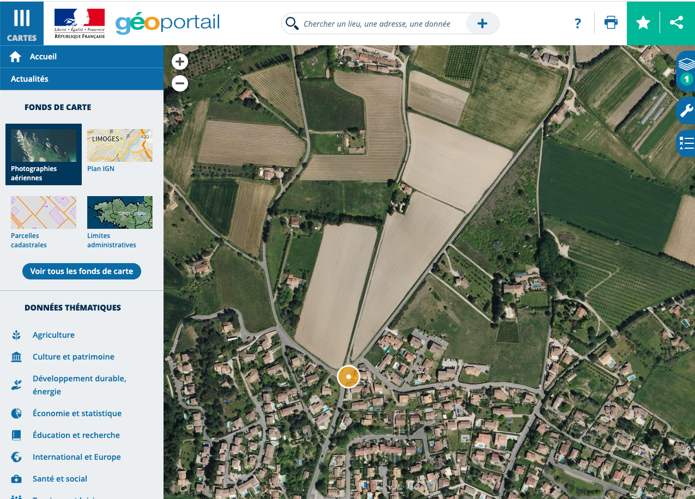
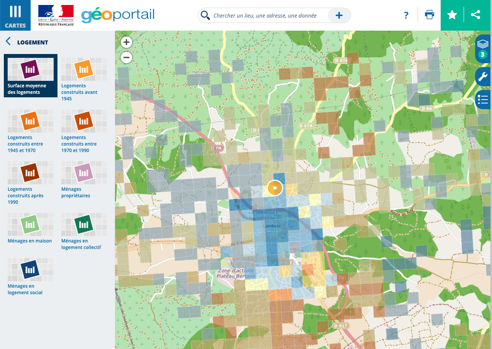
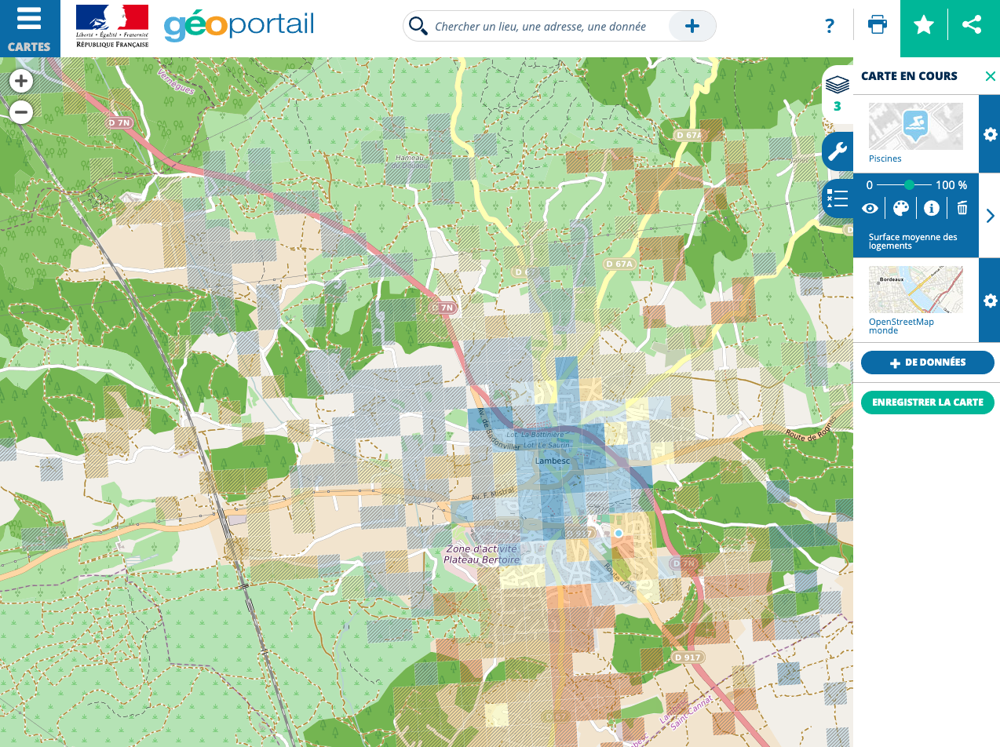

# Diagnostic de l'environnement

## Géoportail

[Géoportail](https://www.geoportail.gouv.fr/le-projet-geoportail) est un projet de l'Institut géographique national initié en 2006 et visant à faciliter l'accès à l'information géographique de référence. Par des ajouts successifs de bases de données, il donne aujourd'hui accès gratuitement à une grande variété de ressources :

* fonds de cartes thématiques et historiques ;

* localisation de bâtiments et services ;

* données démographiques, etc.

### Les bases

Géoportail a été conçu comme un moteur de recherche géographique. Pour accéder à l'interface complète, il suffit de saisir une adresse ou un lieu (nom de commune, bâtiment remarquable, etc).

Prenons par exemple l'adresse de la médiathèque de Lambesc (13) :

Par défaut, Géoportail propose une vue aérienne de la zone et indique le résultat pour l'adresse demandée sous forme d'un marqueur :

### Principales fonctionnalités

La plupart des fonctionnalités sont accessibles en cliquant sur le bouton « **Cartes** » en haut à gauche de l'interface Géoportail.

#### Fonds de carte

La première option disponible est le choix du fond de carte. L'interface propose par défaut trois fonds de carte (photographies aériennes, carte IGN et plan IGN) ainsi que les parcelles cadastrales qui peuvent être ajoutées par dessus un de ces fonds.

Mais il ne s'agit que d'une petite partie des options disponibles : en cliquant sur « **Voir tous les fonds de carte** », l'intégralité des 14 fonds de carte disponibles s'affiche. Vous pouvez ainsi choisir des cartes topographiques, historiques (carte de 1950, cartes d'Etat major, cartes de Cassini ...) et aussi des cartes issues d'autres services comme Esri ou OpenStreetMap (comme dans notre exemple ci-dessous). La carte sélectionnée apparaît en surbrillance dans le volet *« fonds de carte »* :

#### Données thématiques

L'interface Géoportail propose un certain nombre d'indicateurs et d'objets géolocalisés regroupés par thèmes dans le volet **Cartes**, sous les fonds de carte.

La première catégorie de données que vous pourrez utiliser concerne **les lieux notables ou établissements géolocalisés** : lieux culturels, d'enseignement, sportifs, etc. Il vous suffit de sélectionner la catégorie de lieu que vous souhaitez géolocaliser sur la carte pour que tous les lieux entrant dans ce groupe apparaissent sur la carte sous forme de pictogrammes. En plus de leur emplacement, l'outil propose des données complémentaires qui s'affichent en pop-up lorsqu’on clique sur le pictogramme.

Pour reprendre l'exemple de la médiathèque de Lambesc, il nous suffit de sélectionner la catégorie « **Tourisme et loisirs** » puis « **Sports** » et enfin « **Piscines** » pour faire apparaître toutes les piscines alentour :

Vous aurez également accès à des **données démographiques et économiques géolocalisées**. Issues d’enquêtes statistiques (notamment du recensement de la population), ces données peuvent être visualisées sous forme de carrés (250 ou 500 m de côté), d’où leur nom de « données carroyées ». Pour plus de précisions sur ce que ce terme recouvre, [le site de l'Insee](https://www.insee.fr/fr/statistiques/4176305) propose une riche documentation sur la méthode et ses usages.

La catégorie « **Économie et statistique** » contient par exemple une rubrique « **Logement** » qui vous permettra de visualiser en carreaux la surface moyenne des logements :

Une foule d'autres données sont disponibles, des plus techniques aux plus pratiques :

* lignes de transports en commun ;

* géologie ;

* cartes forestières ;

* zones sismiques, etc.

Nous vous laissons explorer par vous-même !

#### Carte en cours

Il peut cependant arriver que vous entassiez un peu trop d’informations sur votre modeste carte… Heureusement, l’interface permet à tout moment de consulter la liste des données sélectionnées et d’y remettre de l’ordre.

En cliquant sur le bouton « **Couches** » à droite de l'écran, un volet s'ouvre, qui récapitule les données que vous avez ajoutées à la carte :

En plus de récapituler les opérations que vous avez réalisées, ce panneau vous permet de modifier, supprimer ou réordonner les éléments de votre carte.

Dans notre exemple, nous avons décidé de faire trois modifications :

* mettre en valeur les stades (en cliquant - déposant cette couche au dessus des autres) ;

* passer la surface moyenne des logements en noir et blanc (en cliquant sur la palette de la couche concernée) ;

* réduire l'opacité de la même couche (en déplaçant le bouton sur la réglette correspondante).

Et voilà le résultat :

### Exporter ses productions

Une fois les couches choisies et paramétrées, il ne nous reste plus qu'à les partager.

Pour partager le lien vers la carte dans Géoportail, vous disposez de plusieurs options de partage en cliquant sur l'icone **partage** en haut à droite :

* vous pouvez récupérer un lien permanent (qui contient tous les paramètres de la carte et vous permet d'y accéder à volonté), par exemple, [celui de la carte que nous avons créée](https://www.geoportail.gouv.fr/carte?c=-1.1837910184684741,46.16635667973125&z=15&l0=OPEN_STREET_MAP::GEOPORTAIL:OGC:WMTS(1)&l1=INSEE.FILOSOFI.LOGEMENTS.SURFACE.MOYENNE.SECRET::GEOPORTAIL:OGC:WMTS(0.52;g)&l2=POI.SPORT.STADIUM::GEOPORTAIL:OGC:WMS(1)&permalink=yes) ;

* vous pouvez intégrer cette carte à un site Internet avec le code HTML qui permet de l'afficher sur une page web ;

* vous pouvez la partager sur les réseaux sociaux (Facebook et Twitter) ou par mail ;

* vous pouvez enfin *l'imprimer dans un fichier* en cliquant sur le bouton « **Impression** » dans le coin supérieur droit et en choisissant cette option dans la fenêtre qui s'ouvre alors.

### Précautions

Géoportail n'est pas conçu pour permettre la récupération de vos cartes. Aussi, vous risquez de rencontrer quelques difficultés, comme :

* la plateforme Géoportail peut être indisponible temporairement, vous empêchant de consulter vos cartes ;

* l'impression dans un fichier peut modifier le cadrage et supprimer des informatons (comme les isochrones).

Pour vous assurer que vous ne perdrez pas votre carte, nous vous encourageons à la récupérer sous format image en réalisant une capture d'écran.

Pour cela, deux possibilités s'offrent à vous:

1. utiliser la fonction « Capture d'écran » de votre système d'exploitation, soit par un bouton dédié, soit par une combinaison de touches. Des tutos sont disponibles que ce soit pour [PC](https://fr.wikihow.com/faire-une-capture-d%27%C3%A9cran-sous-Windows), [Mac](https://support.apple.com/fr-fr/HT201361) ou [Linux](https://doc.ubuntu-fr.org/capture_d_ecran) ;

2. Installer une extension de navigateur permettant de réaliser des captures d'écran. Parmi les plus populaires et simples d'utilisation, nous pouvons vous recommander Awesome Screenshot disponible en extension [Chrome](https://chrome.google.com/webstore/detail/awesome-screenshot-screen/nlipoenfbbikpbjkfpfillcgkoblgpmj?hl=fr) et [Firefox](https://addons.mozilla.org/fr/firefox/addon/screenshot-capture-annotate/) pour tous les systèmes d'exploitation.

### Fonctionnalités avancées

Le volet « Outils » élargit votre palette vers des fonctionnalités de cartographie plus poussées.

Vous pourrez annoter la carte à l'aide de pictogrammes ou de texte, dessiner des formes etc., et même calculer des itinéraires !

## Applications pratiques

Les outils de Géoportail peuvent être mis à profit du diagnostic environnemental de votre bibliothèque. Avec ses fonctionnalités de base et ses fonctionnalités avancées, nous allons pouvoir composer une carte riche en données sur les environs de votre établissement.

### Localiser les établissements recevant du public alentour

Pour commencer, nous allons identifier les lieux d'intérêt autour d'une bibliothèque : établissements culturels, lieux d'enseignement et lignes de transport.

Rendons-nous à Aix-en-Provence, dans le quartier de la bibliothèque Méjanes, rue des Allumettes. Nous avons choisi **le fond de carte IGN, clair et lisible**, car nous allons avoir beaucoup d'éléments à ajouter par dessus. Une fois la bibliothèque localisée, la carte est prête à être complétée :

Nous allons nous pencher sur plusieurs catégories d'établissements dans les **données thématiques** :

* dans la rubrique « **Culture et patrimoine** », nous pouvons ajouter les **musées**, qui constituent des points d'intérêt culturel majeurs ;

* dans « **Tourisme et loisirs** », n'oublions pas les sports : votre établissement est peut-être sur le chemin d'une **piscine** ou d'un **complexe sportif** ;

* la proximité d'une **gare** (qu'elle soit ferroviaire ou routière) génère également du passage (vous les trouverez dans la rubrique « **Territoires et transports** ») ;

* enfin, de la maternelle à l'enseignement supérieur, les établissements d'**éducation et de recherche** accueillent de potentiels lectrices et lecteurs !

Une fois toutes ces cases cochées, la carte s’est considérablement enrichie en informations : en quelques clics, nous avons ajouté pas moins de huit couches de données !

### Cartographier la démographie aux abords de votre bibliothèque

Deuxième étape : nous souhaitons ajouter des données sur les populations habitant à proximité.

La rubrique « **Économie et statistique** » propose trois entrées : « Démographie », « Logement » et « Niveau de vie ». Nous allons nous intéresser à la **démographie** d'Aix-en-Provence et plus particulièrement au jeune public.

Une fois ajoutée la couche, nous pouvons atténuer un peu les couleurs pour en garder le fond. Nous constatons ainsi un contraste saisissant entre les quartiers au nord de la Méjanes et ceux situés au sud de cette bibliothèque emblématique d’Aix-en-Provence :

### Calculer un rayon de dix minutes de marche

Géoportail propose une fonctionnalité expérimentale : le calcul de l'**isochrone**, c'est-à-dire le rayon couvert dans un temps précis pour un moyen de transport donné.

Ici, nous vous proposons de calculer « *tout ce qui se trouve à dix minutes de marche* » de la bibliothèque Méjanes. Pour cela, il nous faut aller dans l'onglet « **Outils** » et sélectionner « **Mesures** », où se trouve l'option « **Calculer une isochrone** ».

L'interface demande alors plusieurs informations :

* l'adresse de départ ou d'arrivée (ici, celle de la bibliothèque) ;

* la mesure : isochrone (temps donné) ou isodistance (distance donnée) ;

* le temps (en minutes et heures) ;

* le mode de transport (voiture ou piéton) ;

* le sens du parcours (depuis l'endroit indiqué ou dans sa direction).

Pour notre calcul, nous allons chercher à savoir tous les endroits depuis lesquels l'on peut rejoindre la Méjanes à pied en dux minutes ou moins. La Méjanes sera donc **le point d'arrivée** ; la durée dix minutes ; le mode de transport, piéton. Une fois les paramètres renseignés, Géoportail lance le calcul et affiche en vert la zone couverte :

Nous apprenons ainsi qu'à dix minutes à pied de cette médiathèque se trouvent :

* une gare (et une 2ème à une minute de plus) ;

* un musée ;

* cinq établissements d'enseignement supérieur ;

* cinq établissements d'enseignement primaire et secondaire ;

* plusieurs quartiers « jaunes », c'est-à-dire avec plus de 20 % d'individus de moins de 18 ans.

Superposées sur une même carte, ces informations permettent d'objectiver les caractéristiques du territoire dans lequel s'ancre la bibliothèque et d'identifier de possibles interactions avec d'autres structures et les populations qui l'habitent ou le traversent.