# Usagers et non-usagers

Après avoir diagnostiqué l'établissement et son environnement, portons notre regard sur les usagers et les non-usagers des médiathèques de notre territoire. Cette partie implique de réaliser une comparaison entre les données sur les publics de la médiathèque et la composition du territoire. La comparaison nous renseignera, en filigrane, sur les non-usagers des médiathèques. Il nous faut récupérer et visualiser ces deux types de données. 

On considère ici un usager comme une personne ayant fréquenté au moins une fois dans l’année un établissement de lecture publique et un non-usager comme une personne qui ne s’est pas rendue en bibliothèque depuis plus d’un an. 

## Données sur les usagers : l'observatoire de la lecture publique

Le ministère de la Culture collecte annuellement les données chiffrées de chaque bibliothèque territoriale. Ces données agrégées permettent d’alimenter et d’analyser les statistiques du ministère sur la lecture publique. Elles constituent également un moyen objectif pour les établissements de se connaitre, d’évaluer l’ensemble de leurs actions, mieux cerner leurs usagers, de réfléchir sur les non-usagers, et de s'interroger sur les pratiques culturelles. 
 
C’est le rapport que vous remplissez chaque année par le biais de votre bibliothèque départementale ou directement sur internet. 
 
Les données compilées sont ensuite intégrées et mises à votre disposition dans l’Observatoire de la lecture publique, où un [outil cartographique](https://olp.culture.fr/#c=home) rend possible le croisement de certaines données et leur affichage par territoire.

Parmi les données du questionnaire, nous nous intéressons ici particulièrement aux données socio-économiques qui permettent une comparaison avec les statistiques publiques collectées par l'INSEE et les autres acteurs de la statistique publique. 

L'Observatoire de la lecture publique propose dans son outil cartographique uniquement des statistiques relatives aux caractéristiques des emprunteurs, essentiellement l'âge et le taux d'emprunteurs.

Ces données n'étant toujours pas ouvertes sur data.culture.gouv.fr, vous devrez vous tourner vers le questionnaire que votre établissement ou votre collectivité a transmis à l'observatoire de la lecture publique pour avoir accès à l'ensemble des informations collectées sur votre territoire.

## Données sociodémographiques : découverte de l'outil Geoclip "regard cartographique sur nos territoires de la Région Sud"

Maintenant que vous avez regroupé les données aux usagers de votre territoire, vous allez pouvoir les comparer avec les caractéristiques de l'ensemble des habitants pour tenter d'identifier les caractéristiques des non-usagers de la médiathèque. Pour vous aider dans l'usage des données statistiques publiques, le service Connaissance du territoire de la Région Sud propose un ensemble d’outils pour  explorer un grand nombre d’indicateurs statistiques localisés, de les analyser, les comparer, les représenter, les cartographier, les exporter sur le site suivant : https://notreterritoire.maregionsud.fr/. 

Pour faciliter le cheminement de l’utilisateur dans l’observatoire, on distingue quatre espaces de travail, chacun dédié à une démarche spécifique :

* Indicateurs : rechercher et visualiser des indicateurs autour d’une problématique donnée,
* Rapports : sélectionner un territoire et éditer des rapports détaillés sur celui-ci,
* Zonages : analyser et comparer différents découpages géographiques,
* Données externes : importer des données selon vos usages, se connecter à d’autres entrepôts.

### Indicateurs : la cartographie interactive paramétrable 

L'interface de l'outil Geoclip se décompose en deux zones principales : pilotage de la carte et visualisation de la carte. On retrouve ce même outil pour visualiser les données de l'observatoire de la commande publique. 

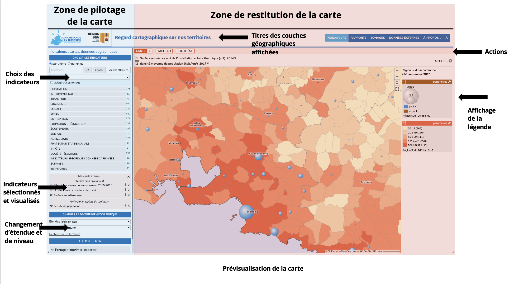

#### Choisir un découpage géographique

En bas à gauche de la page, l'interface permet de sélectionner le découpage géographique qui fondera l'analyse. 

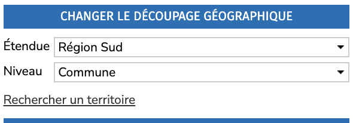

Trois options sont proposées : 
* l'**étendue** de la carte : la zone couverte par la carte (France ou Région Sud)
* le **niveau** de précisions des données affichées dans la carte
* la ** recherche** d'un territoire sur lequel la carte sera centrée et la légende proposera des comparaisons entre ce territoire et les valeurs nationales ou régionales. 

Le niveau de précision présente de nombreuses options. Pour notre usage de diagnostic des médiathèques, on pourra alterner entre ces niveaux : 
* EPCI (Établissement public de coopération intercommunale), échelon administratif regroupant plusieurs communes. 
* Conseils de territoire : pour la métropole Aix Marseille uniquement, ce niveau propose des indicateurs à l'échelle des six conseils qui exercent des compétences de proximité. 
* Commune : pour Marseille, l'outil propose aussi un niveau arrondissement municipal
* IRIS : les communes d'au moins 10 000 habitants et la plupart des communes de 5 000 à 10 000  habitants sont découpées en IRIS, une partition du territoire de ces communes en "quartiers" dont la population est de l'ordre de 2 000 habitants. Par extension, afin de couvrir l'ensemble du territoire, on assimile à un IRIS chacune des communes de France non découpées en IRIS.

#### Choisir des indicateurs

Après avoir sélectionné un découpage géographique, nous avons sélectionné les indicateurs pertinents par rapport à notre analyse. L'outil propose plusieurs centaines d'indicateurs sur une centaine de thématiques, les données sont préchargées et peuvent être visualisées immédiatement :

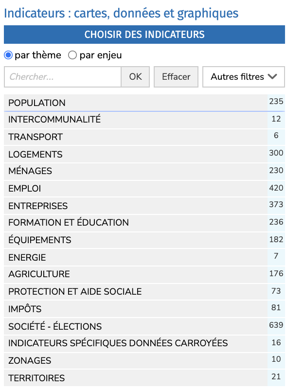
Il est aussi possible de catégoriser les indicateurs par enjeu comme économie ou transition environnementale en cochant la case par enjeu. Le menu "autres filtres" permet de filtrer par type de représentation des données sur la carte. 

Après avoir sélectionné un thème, des sujets sont proposés. Nous allons sélectionner "populations légales" dans le thème "population" pour visualiser la densité de population sur le territoire de la région. Notez que pour un même indicateur plusieurs formes de visualisation sont proposés. Par exemple, il est possible de visualiser ces données sous la forme d'aplats de couleurs dont le contraste varie selon la densité de population ou sous la forme de ronds dont le diamètre varie là aussi selon la valeur absolue, la population dans l'échelon choisi (commune ou IRIS par exemple). 

Une fois l'indicateur sélectionné, il apparaît en dessous dans la rubrique "mes indicateurs". Le bouton ℹ permet d'afficher la documentation du jeu de données : informations sur le producteur, description des données, précisions sur la méthodologie, statistiques sur la distribution de cette variable, liens vers la documentation officielle… 

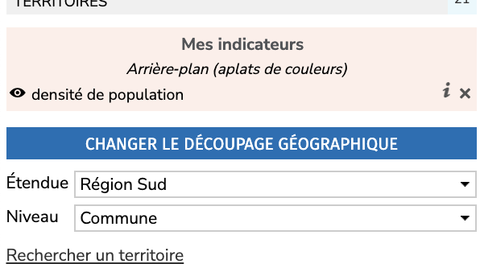

En haut de la carte, le titre indique les intitulés des indicateurs sélectionnés et permet, pour certains jeux de données, de changer l'année des données voire de produire une animation dans le temps (évolution de la densité sur les 10 dernières années par exemple).
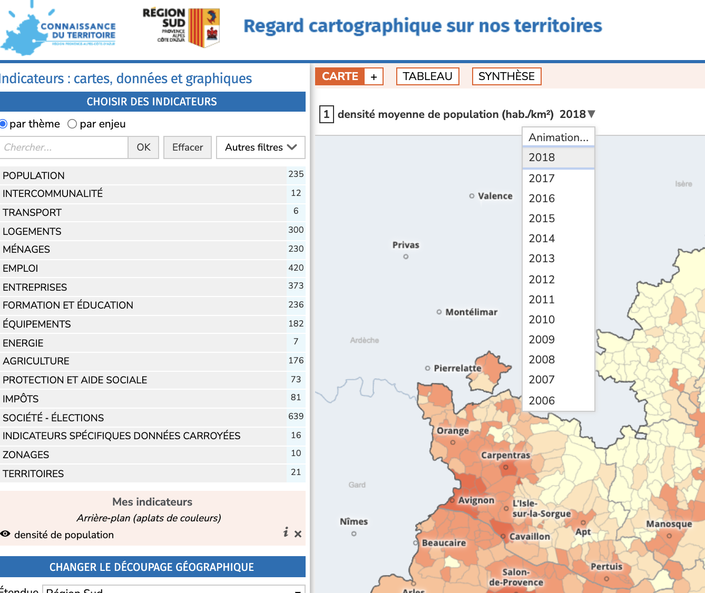

Il est ensuite possible de superposer un deuxième indicateur. Notez qu'il ne peut y avoir que deux indicateurs visualisés en simultané, un en arrière-plan et l'autre sous la forme de symboles superposés sur la carte. Prenons par exemple des données sur l'offre en matière de santé dans la rubrique "équipement" en sélectionnant "services et équipements de santé"  avec l'indicateur du nombre de médecins généralistes. La carte superpose désormais des bulles correspondant au nombre de médecins généralistes par territoire. 

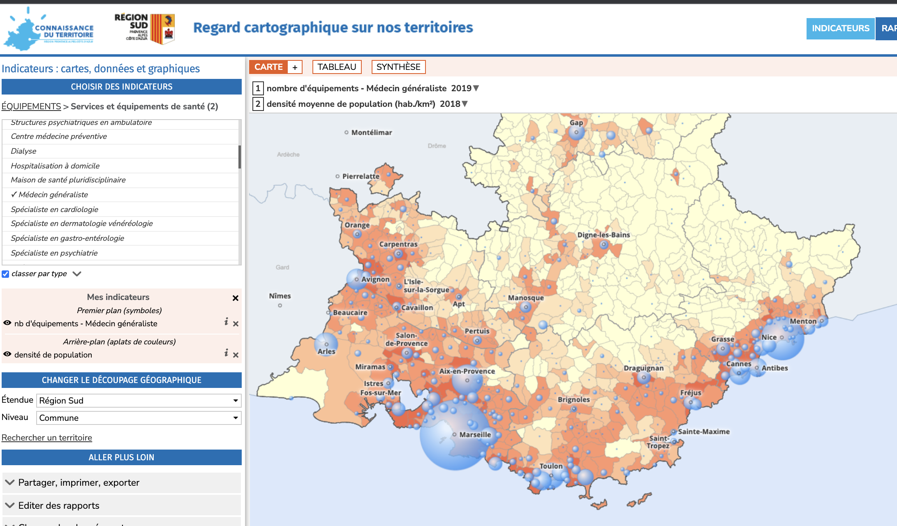

L'onglet "Tableau" affiche les données qui ont produit la carte sous une forme tabulaire. Il est possible de filter et d'exporter ce tableau depuis le menu actions. 

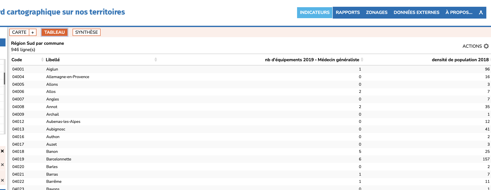
L'onglet "Synthèse" propose des chiffres clés et des graphiques sur certains indicateurs comme ici la densité de population en comparaison avec le territoire sélectionné (ici la commune d'Aix-en-Provence) : 
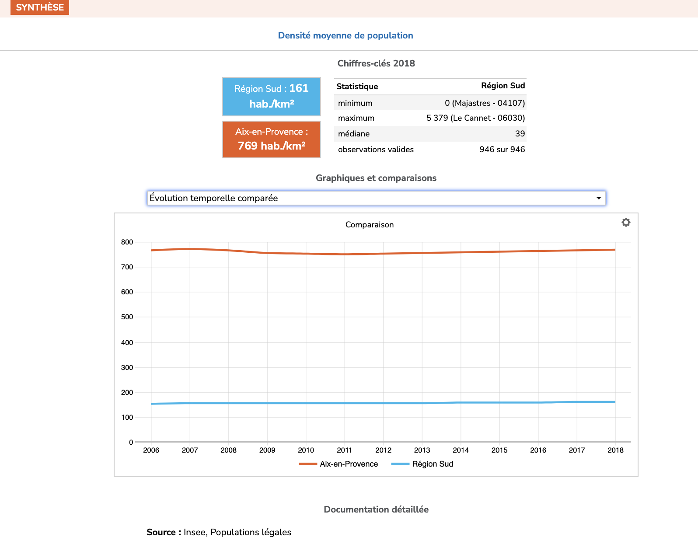
#### Exporter la carte 

Dans la légende (colonne à gauche de l'écran), vous pouvez cliquer sur le bouton "paramètres" pour changer les paramètres d'affichage de chaque indicateur. Par exemple, pour la densité de population, vous pouvez changer le thème de couleurs appliqué et modifier les seuils.
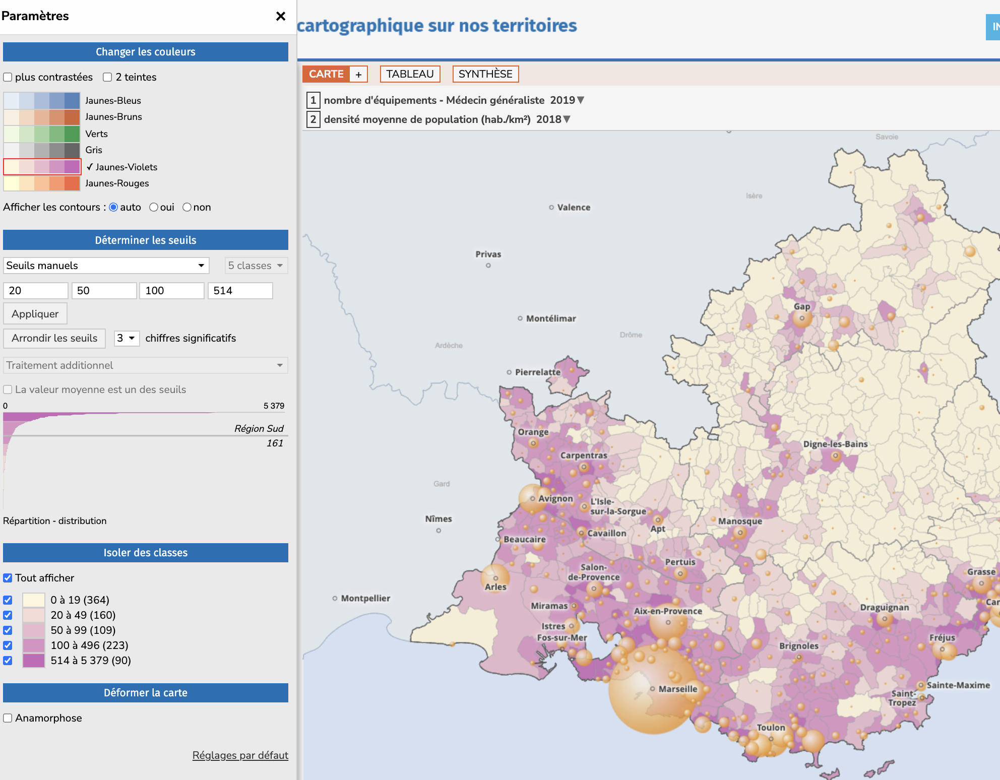

Il est même possible de créer une carte anamorphique qui déforme la géographie, le contour des communes, en fonction de la population de chacune d'entre elles. Intéressant sur le fond pour mieux rendre compte de la répartition de la population sur le territoire mais à réserver à un public averti !

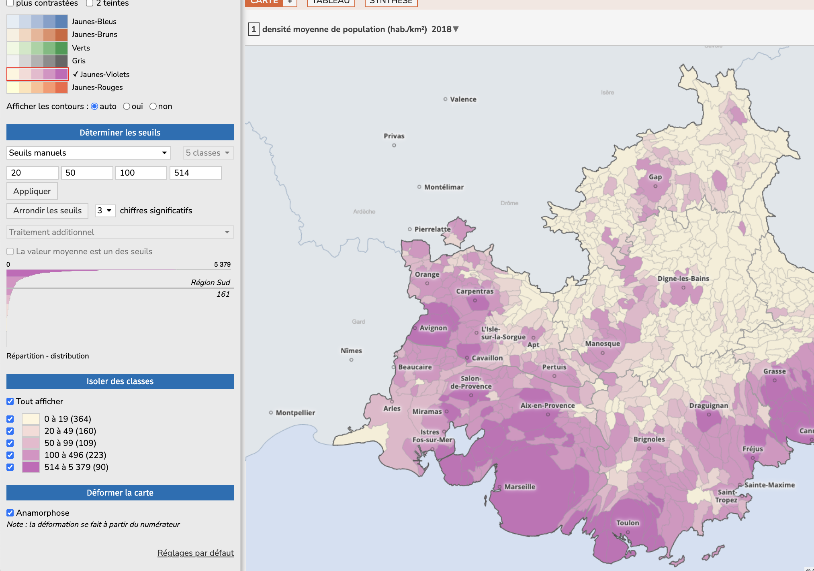

Le menu Actions propose plusieurs options pour enrichir la carte. "Ajouter des couches" permet de superposer un fonds de carte comme celui d'OpenStreetMap pour retrouver les principaux axes routiers et les espaces naturels structurant le territoire. Il y est aussi possible de rajouter dans la carte les contours des EPCI ou départements. 

Toujours dans le menu Actions, "Exporter" produit un fichier image ou PDF. "Imprimer" propose un rendu imprimable de la carte avec la légende et les éléments contextuels permettant de la comprendre. 

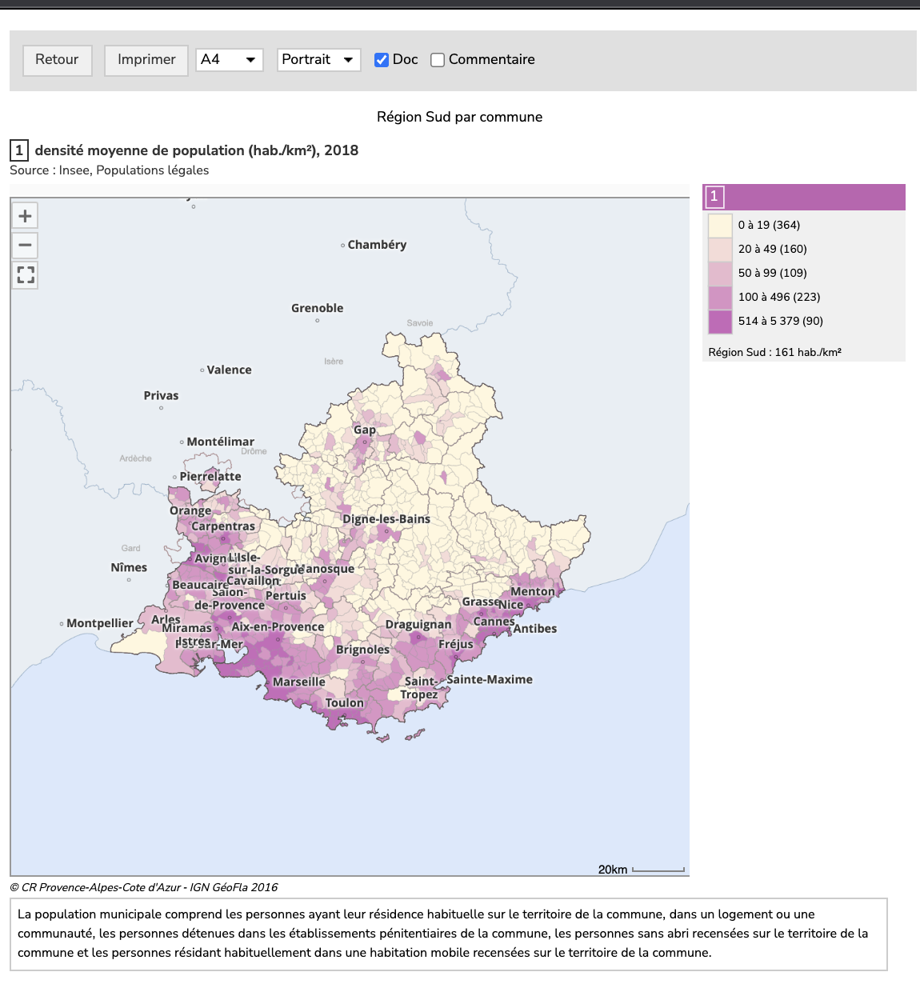

### Rapports : des graphiques pour un portrait de territoire

L'outil "Rapports" proposé par la Région Sud permet de produire rapidement une série d'indicateurs essentiels pour dresser un portrait de territoire. Comme dans l'outil carte, l'interface se décompose en deux espaces : pilotage du rapport à gauche et visualisation du rapport à droite. 

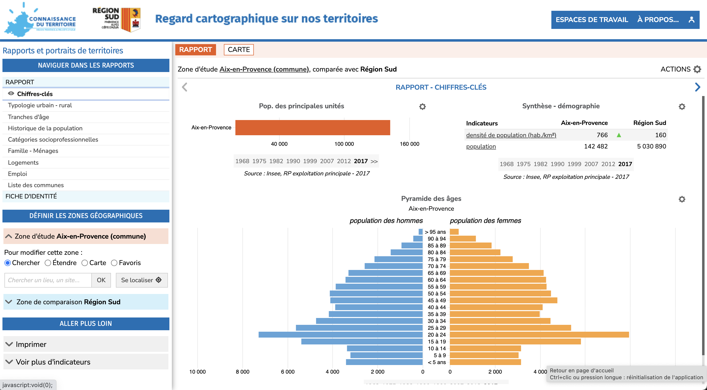

Pour créer le rapport, il faut déjà déterminer la zone d'étude qui correspond au territoire étudié et la zone de comparaison qui peut être la région Sud, un département ou encore un EPCI. Le module de sélection est identique à celui de l'outil de cartographie.

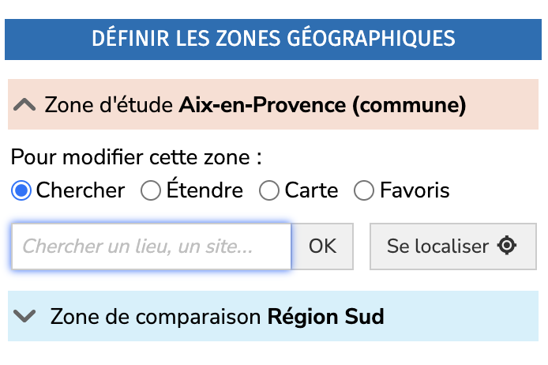

Après avoir sélectionné une zone, le rapport est découpé en une série de chapitres dans lesquels vous pouvez naviguer depuis le menu "naviguer dans les rapports" dans la partie supérieure gauche. 
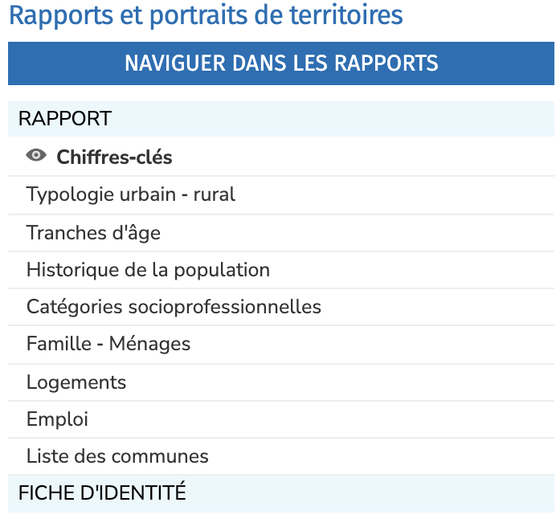

En sélectionnant un chapitre du rapport, une série de graphiques est proposée, par exemple ici sur l'évolution de la population à Aix-en-Provence en comparaison avec la Région Sud.

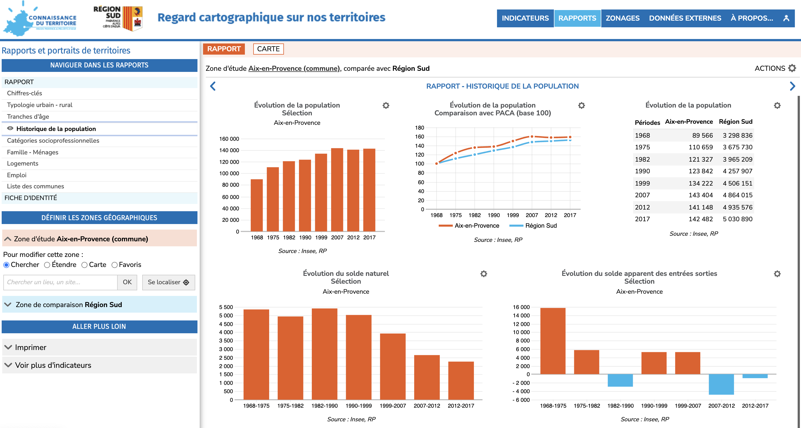

#### Exporter le rapport

Le rapport peut être imprimé depuis le menu Actions. La fonction "Imprimer" génère un rapport au format de votre choix sur un des chapitres du rapport.

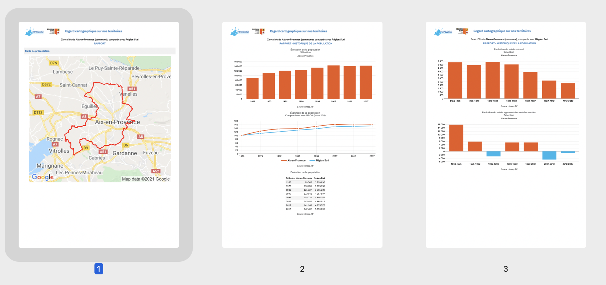

Dans le menu Actions toujours, la fonction "Imprimer tout" assemble tous chapitres du rapport en un seul document. 

## S'appuyer sur les études et analyses des acteurs du territoire

De nombreux acteurs publics produisent des analyses et études qui pourront compléter votre analyse. 

Le service **Connaissance du territoire de la Région Sud** propose une [bibliothèque d'études](https://connaissance-territoire.maregionsud.fr/connaissance-du-territoire/la-bibliotheque-detudes) régulièrement actualisée qui recense des publications issues de la Région, des collectivités régionales, des services de l'État, des agences d'urbanisme. Le même site propose des [portraits de territoire](https://connaissance-territoire.maregionsud.fr/connaissance-du-territoire/les-portraits-de-territoire/) à l'échelle des EPCI de la région, une [cartothèque](https://connaissance-territoire.maregionsud.fr/connaissance-du-territoire/la-cartotheque/) qui collecte des cartes produites, en libre accès et la [Focale](https://connaissance-territoire.maregionsud.fr/connaissance-du-territoire/la-focale-regionale/), un magazine qui présente un éclairage sur les études produites dans le cadre des partenariats de la connaissance.

Les **agences d'urbanisme** sont créées à l'initiative des collectivités pour développer une expertise sur l’urbanisme (planification, habitat, mobilités, économie, environnement, foncier…) et fournissent un appui des collectivités aux niveaux stratégiques et opérationnels Au niveau régional, quatre agences d'urbanisme interviennent sur différentes parties du territoire comme le montre cette [carte de la FNAU](https://www.fnau.org/fr/les-agences-durbanisme/) (Fédération nationale des agences d'urbanisme) : 
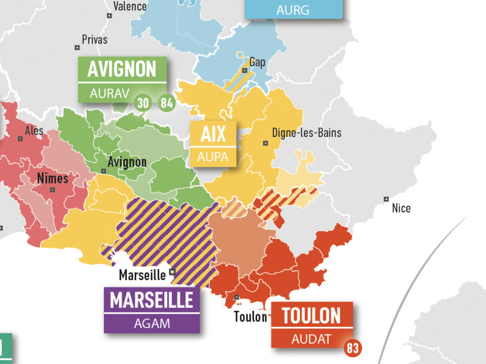

Les agences produisent de nombreuses études pertinentes pour comprendre le territoire, en particulier dans la rubrique "publications et études" de leur site : 
* [AGAM (Agence d'urbanisme de l'agglomération marseillaise)](https://www.agam.org/les-publications-de-lagam/)
* [AUPA (Agence d'urbanisme de l'agglomération du Pays d'Aix)](https://aupa.fr/publications-et-animations/#publications)
* [AURAV (Agence d'Urbanisme Rhône Avignon Vaucluse)](http://www.aurav.org/publications/)
* [AUDAT (Agence d'Urbanisme de l'Aire Toulonnaise et du Var)](https://audat.org/les-grands-travaux/nos-publications/). 

Dans la métropole Aix-Marseille-Provence, les agences d’urbanisme du Pays d’Aix-Durance (Aupa) et de l’agglomération marseillaise (Agam) proposent des **[portraits de communes](https://aupa.fr/portraits-de-communes/)** pour chaque commune de la métropole regroupant les chiffres les plus significatifs. Chaque commune est représentée en 150 chiffres et deux cartes pour synthétiser les informations essentielles à connaitre.

