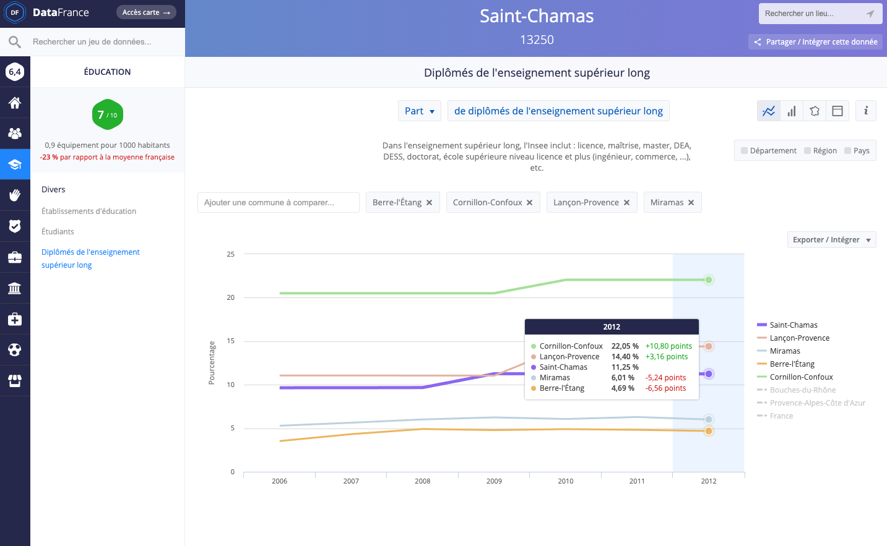

# Usagers et non usagers

## Outil de collecte et visualisation des données : DataFrance

Le site DataFrance propose un accès simple et intuitif à de nombreux jeux de données isssus des statistiques publiques à l'échelle de la commune. Les séries de données couvrent des sujets variés et sont issus de nombreuses sources officielles :

* **Population** : Insee, Caf, Ministère des finances et des comptes publics ;

* **Education** : Insee et Ministère de l'éducation nationale ;

* **Service** : Arcep, Ministère de l'Intérieur, Mission très haut débit ;

* etc.

La principale limite de cet outil est qu'il ne permet d'accéder qu'à certaines enquêtes de population, parfois un peu datée. La plupart des données de population Insee, par exemple, ne sont pas disponible au delà de l'année 2012. C'est un point à garder à l'esprit au moment de présenter les résultats.

### Les bases

[La page d'accueil de DataFrance](https://datafrance.info/) propose un moteur de recherche basé sur les communes.

Il suffit de taper le nom de la commune qui vous intéresse dans la barre d'invitation au centre de la page et des propositions apparaîssent immédiatement dans un menu déroulant. Comme ici pour la commune de Troyes :

Une fois choisie la commune, une nouvelle interface apparaît, centrée autour de la commune choisie. Elle comporte trois parties principales :

1. à droite, les informations générales sur la commune : territoire, nom et orientation du ou de la maire, population, densité, etc.

2. au centre, outre la description et la localisation de la commune, l'interface DataFrance propose des **indices de qualité de vie** : en analysant les données disponibles, le site propose une note sur dix sur cinq domaines (Education, Commerce, Santé, Service et Sport et loisirs) et une note synthétique suivant [une méthodologie détaillée sur une page dédiée](https://datafrance.info/indices-datafrance). Outre la fiche, une synthèse visuelle est proposée sous la forme d'[un diagramme en radar](https://fr.wikipedia.org/wiki/Diagramme_de_Kiviat) ;

3. à gauche enfin, un bandeau bleu déroule une série de pictogramme représentant les diverses données rendues disponibles sur le site dans diverses rubriques : immobilier, population, éducation, etc. C'est dans ce panneau que nous allons trouver les outils nécessaires à notre diagnostic.

### Principales fonctionnalités

Pour chaque ville, DataFrance propose des séries de données de divers types pour découvrir le territoire :

1. données géolicalisées (établissements de santé, de sport, administrations ...) ;

2. données ponctuelles (entreprises par secteur, résultats électoraux ...) ;

3. données historiques par années (évolution des revenus déclarés, des effectifs d'étudiant·es, des infractions ...).

Pour la ville de Troyes, nous pouvons par exemple nous pencher sur les personnes diplômées de l'enseignement supérieur long (une des trois séries de données disponibles dans la rubrique *Education*).

#### Visualiser les données clefs

En cliquant sur les données demandées, l'interface DataFrance bascule dans une autre page où la donnée demandées est visualisées automatiquement. Dans notre cas, s'agissant d'une série historique, le site propose un graphique en ligne s'étalant sur toute la période disponible (2006 à 2012) :

#### Modifier les indicateurs

Le graphique proposé repose sur les valeurs relatives : la part de la population diplômé de l'enseignement supérieur long.

Or, si d'autres indicateurs sont disponibles, l'interface permet d'en changer pour modifier la perspective. Sous le nom de l'indicateur, le *"Part"* de *"Part de diplômés de l'enseignement supérieur long"* est accompagné d'une flèche indiquant qu'il s'agit d'un choix dans une liste. En cliquant dessus, un menu déroulant s'ouvre qui propose, outre ce premier indicateur, de présenter ces effectifs en *"Nombre"*, c'est-à-dire en valeur absolue. Il suffit de sélectionner cette option pour que le graph se redessine instantanément :

Le graphique peut également être modifié : pour chaque série (et conformément au type de données), plusieurs types de graphiques sont proposés. Ici, puisque nous raisonnons en valeur absolues, une bonne pratique consiste à basculer en graphique en barre, lesquels figurent mieux les quantités :

#### Comparaisons

DataFrance permet aussi de comparer les données d'une commune. Soit à des données d'autres échellons administratifs, soit à des villes limitrophes.

Pour ajouter les autres échellons administratifs, il suffit de cliquer sur leur nom qui apparaît à droite de l'interface, juste sous le choix des graphs. En trois clics, nous pouvons ainsi comparer Troyes avec son département (l'Aube), son ancienne région (Champagne Ardenne) et la France entière :

Il est également possible de comparer avec des communes limitrophes.

Pour cela, un champs est disponible au dessus à gauche du graph sous lequel un choix de villes apparaît quand on clique pour y écrire. En ajoutant quatre communes autour de Troyes, le graph permet de constater que, si Saint-Julien-les-Villas et Sainte-Savine présentent des taux de diplômes comparables, La Chapelle-Saint-Luc et Pont-Sainte-Marie affichent des ratios bien plus faibles. Pour vérifier cette impression, un simple survole du graph fait apparaît les valeurs pour chaque année :

### Exporter ses productions

[problèmes d'export sur le site]

## Applications pratiques

### Comparaison des publics

[exemple à trouver]