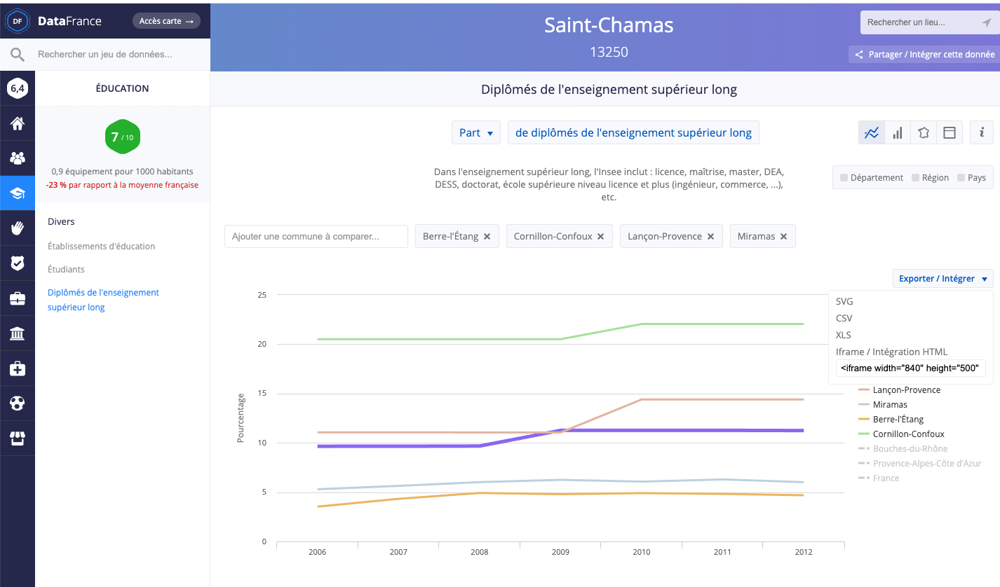

# Usagers et non usagers

## Outil de collecte et visualisation des données : DataFrance

Le site [DataFrance](https://datafrance.info/) propose un accès simple et intuitif à de nombreux jeux de données issus des statistiques publiques à l'échelle de la commune. Les séries de données couvrent des sujets variés et sont issues de nombreuses sources officielles :

* **Population** : Insee, Caf, ministère des finances et des comptes publics ;

* **Éducation** : Insee et ministère de l'Éducation Nationale ;

* **Service** : Arcep, ministère de l'Intérieur, Mission très haut débit. 

La principale limite de cet outil est qu'il ne permet d'accéder qu'à certaines enquêtes de population, parfois un peu datéees. La plupart des données de population Insee, par exemple, ne sont pas disponibles au delà de l'année 2012. C'est un point à garder à l'esprit au moment de présenter les résultats.

### Les bases

[La page d'accueil de DataFrance](https://datafrance.info/) propose un moteur de recherche par commune.

Il suffit de taper le nom de la commune qui vous intéresse dans la barre d'invitation au centre de la page et des propositions apparaîssent immédiatement dans un menu déroulant. Comme ici pour la commune de Troyes :

Une fois la commune choisie, une nouvelle interface apparaît, centrée autour de la commune sélectionnée. Elle comporte trois parties principales :

1. À droite, les informations générales sur la commune : territoire, nom et orientation politique du ou de la maire, population, densité, etc.

2. Au centre, outre la description et la localisation de la commune, l'interface DataFrance propose des **indices de qualité de vie** : en analysant les données disponibles, le site propose une note sur dix pour cinq domaines (Éducation, Commerce, Santé, Service et Sport et Loisirs) et une note synthétique suivant [une méthodologie détaillée sur une page dédiée](https://datafrance.info/indices-datafrance). Outre la fiche, une synthèse visuelle est proposée sous la forme d'[un diagramme en radar](https://fr.wikipedia.org/wiki/Diagramme_de_Kiviat) ;

3. À gauche enfin, un bandeau bleu déroule une série de pictogrammes représentant les diverses données rendues disponibles sur le site dans diverses rubriques : immobilier, population, éducation, etc. C'est dans ce panneau que nous allons trouver les outils nécessaires à notre diagnostic.

### Principales fonctionnalités

Pour chaque ville, DataFrance propose des séries de données de divers types pour découvrir le territoire :

1. données géolicalisées (établissements de santé, de sport, administrations ...) ;

2. données ponctuelles (entreprises par secteur, résultats électoraux ...) ;

3. données historiques par années (évolution des revenus déclarés, des effectifs d'étudiant·es, des infractions ...).

Pour la ville de Troyes, nous pouvons par exemple nous pencher sur les personnes diplômées de l'enseignement supérieur long (une des trois séries de données disponibles dans la rubrique *Education*).

#### Visualiser les données clés

En cliquant sur les données demandées, l'interface DataFrance bascule dans une autre page où la donnée demandée est visualisée automatiquement. Dans notre cas, s'agissant d'une série historique, le site propose un graphique en ligne s'étalant sur toute la période disponible (2006 à 2012) :

#### Modifier les indicateurs

Le graphique proposé repose sur les valeurs relatives : la part de la population diplômé de l'enseignement supérieur long.

Si d'autres indicateurs sont disponibles, l'interface permet d'en changer pour modifier la perspective. Sous le nom de l'indicateur, le *"Part"* de *"Part de diplômés de l'enseignement supérieur long"* est accompagné d'une flèche indiquant qu'il s'agit d'un choix dans une liste. En cliquant dessus, un menu déroulant s'ouvre et propose, outre ce premier indicateur, de présenter ces effectifs en *"Nombre"*, c'est-à-dire en valeur absolue. Il suffit de sélectionner cette option pour que le graphique se redessine instantanément :

Le graphique peut également être modifié : pour chaque série (et conformément au type de données), plusieurs types de graphiques sont proposés. Ici, puisque nous raisonnons en valeur absolue, une bonne pratique consiste à basculer en graphique en barre, lesquels figurent mieux les quantités :

#### Comparaisons

DataFrance permet aussi de comparer les données d'une commune. Soit à des données d'autres échelons administratifs, soit à des villes limitrophes, soit à d'autres villes de taille comparable.

Pour ajouter les autres échelons administratifs, il suffit de cliquer sur leur nom qui apparaît à droite de l'interface, juste sous le choix des graphs. En trois clics, nous pouvons ainsi comparer Saint-Chamas avec son département (les Bouches-du-Rhône), sa région (Provence-Alpes-Côte d'Azur) et la France entière :

Il est également possible de comparer avec des communes limitrophes.

Pour cela, un champs est disponible au-dessus à gauche du graphique sous lequel un choix de villes apparaît quand on clique pour y écrire. Un simple survol du graphique fait apparaître les valeurs pour chaque année :

### Exporter ses productions

Une fois vos sélections réalisées, il est possible de les exporter pour les réutiliser, soit dans un document, soit sur votre site.

Pour connaître les options disponibles, il vous suffit de cliquer sur le bouton **Export/Intégrer** juste à droite du graphique :

Quatre options s'offrent alors à vous :

* exporter en **SVG** : il s'agit d'un format de fichier image composé de vecteur, ce qui permet de l'utiliser dans un logiciel d'édition d'image (comme Photoshop ou Gimp) sans risque qu'il se décompose en pixels disgracieux ;
* exporter en **CSV** ou **XLSX** : 
* intégrer la visualisation à une page HTML avec un **iframe**, c'est-à-dire un cadre d'affichage à l'intérieur duquel sera repris le graphique comme il apparaît sur le site.

## Applications pratiques

### Comparaison des publics

> *[problème de mise à jour DataFrance n'est pas màj depuis 2015 : devrions-nous proposer de récupérer les données pour les visualiser en Datawrapper comme proposé initialement ? Certaines fonctionnalités ne fonctionnent plus et les données ne dépassent pas 2012.]*