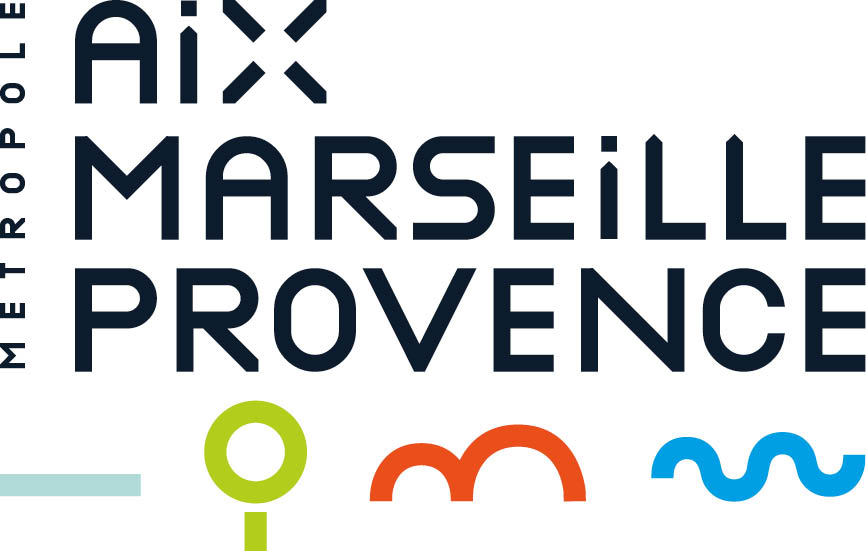

--- 
title: "Kit data des bibliothèques"
date: "`r format(Sys.Date(    ), '%d/%m/%Y')`"
site: bookdown::bookdown_site
documentclass: book
bibliography: [book.bib, packages.bib]
biblio-style: apalike
link-citations: yes
description: "Le kit data bibliothèque offre aux établissements souhaitant entamer une démarche d'extension des horaires des méthodes et outils pour inclure des analyses de données au bilan préalable."
---

# Introduction {-}

Ce kit vise à fournir aux bibliothèques souhaitant entamer une démarche d'optimisation des horaires d'ouverture, des outils leur permettant de traiter des données disponibles pour documenter leur dossier.

Complément du kit bibliothèque proposé par l'Agence régionale du livre Provence-Alpes-Côte d'Azur, ce kit data s'attarde sur trois étapes :

1. Le diagnostic de l'établissement ;

2. Le diagnostic du territoire ;

3. Les usagers et non usagers.

Pour chaque partie, une fois les enjeux de données présentés, est exposé :

* la méthode de collecte des données ;

* un outil gratuit de visualisation ;

* des exemples pratiques de traitements et visualisations à intégrer à votre projet.

Une réalisation de Datactivist (Sylvain Lapoix et Samuel Goëta), en partenariat avec l'Agence régionale du Livre Provence-Alpes-Côte d'Azur pour la Métropole Aix-Marseille Provence, publiée sous licence [CC BY-SA 4.0](https://creativecommons.org/licenses/by-sa/4.0/deed.fr) (Attribution - Partage dans les Mêmes Conditions 4.0 International) permettant la réutilisation tout en garantissant que le contenu restera ouvert.