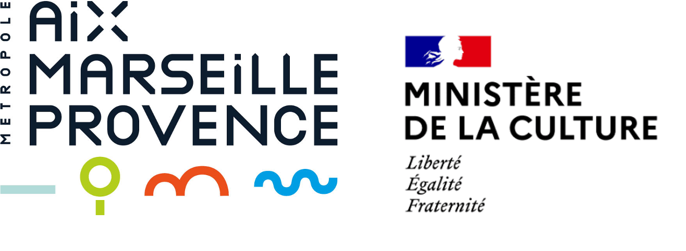

--- 
title: "Petit guide à l’utilisation de la donnée en bibliothèque"
date: "`r format(Sys.Date(    ), '%d/%m/%Y')`"
site: bookdown::bookdown_site
documentclass: book
bibliography: [book.bib, packages.bib]
biblio-style: apalike
link-citations: yes
description: "Petit guide à l’utilisation de la donnée en bibliothèque offre aux établissements souhaitant entamer une démarche d'extension des horaires des méthodes et outils pour inclure des analyses de données au bilan préalable."
---
# Introduction {-}

Ce kit vise à fournir aux bibliothèques souhaitant entamer une démarche d'optimisation de leurs horaires d'ouverture, des outils leur permettant de traiter les données disponibles pour documenter leur dossier.

Complément du Guide pratique à l’Optimisation des horaires d’ouverture des bibliothèques proposé par l'Agence régionale du Livre Provence-Alpes-Côte d'Azur, ce Petit guide à l’utilisation de la donnée en bibliothèque explique pas à pas les trois étapes suivantes :

1. Le diagnostic de l'établissement ;

2. Le diagnostic du territoire ;

3. le diagnostic des usagers et non-usagers.

Pour chaque partie, une fois les enjeux de données présentés, sont exposés :

* la méthode de collecte des données ;

* un outil gratuit de visualisation ;

* des exemples pratiques de traitement et de visualisations à intégrer à votre projet.

Une réalisation de Datactivist (Sylvain Lapoix et Samuel Goëta), en partenariat avec l’Agence régionale du Livre Provence-Alpes-Côte d’Azur pour la métropole Aix-Marseille-Provence, publiée sous licence [CC BY-SA 4.0](https://creativecommons.org/licenses/by-sa/4.0/deed.fr) (attribution-partage dans les mêmes conditions 4.0 international), permettant la réutilisation tout en garantissant que le contenu restera ouvert.
